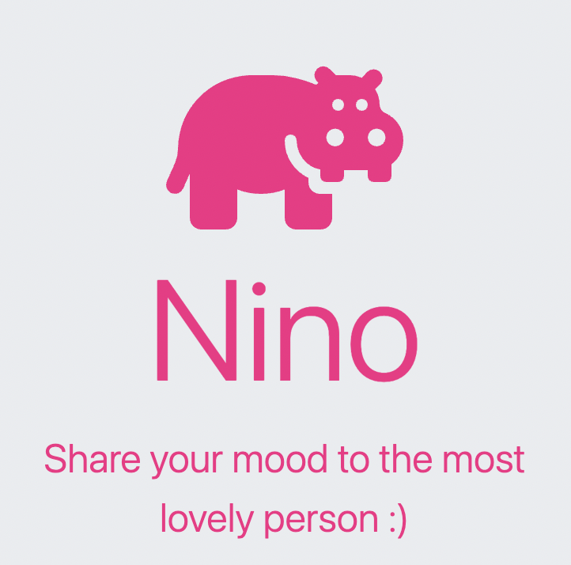

# Nino: Write a Shared Diary with Your Partner

Nino is a web application that enables couples to write a shared diary. It allows couples to write, share and reminisce about their memories together. 

https://nino-1nba.onrender.com/

## Features

- Create an account and login
- In the home page, there are blogs from other users using this app
- Links to "My Diary" and "Our Diary" can be found on the home page
- To use "Our Diary", we need to first add your partner by entering his/her email. Then, after your partner add you from the same process, you can happily writing your shared diary
- Add memories, thoughts, and pictures (I'm still working on this function) to the diary
- View the diary together and relive past memories
- Option to write your private diary in "My Diary"
- Secret 1: you can also add yourself as your partner, and every time you write a diary, your partner write that diary too
- Secret 2: don't show your current partner your own page of "Our Diary" if you aren't confident enough, because your past memory will always stay on this app

## Technologies Used

- Front-end: HTML, CSS, JavaScript, ejs
- Back-end: Node.js, Express.js, MongoDB

## Installation

1. Clone this repository to your local machine
2. Install dependencies using `npm install`
3. Start the app.js using `node app.js`

## Usage

1. Create an account
2. Write your own diary or convince your partner to register for this app
3. If she/he agrees, start writing in the shared diary
3. View the diary together and relive past memories

## License

[MIT](https://choosealicense.com/licenses/mit/)

## Thank you for checking out Nino!
